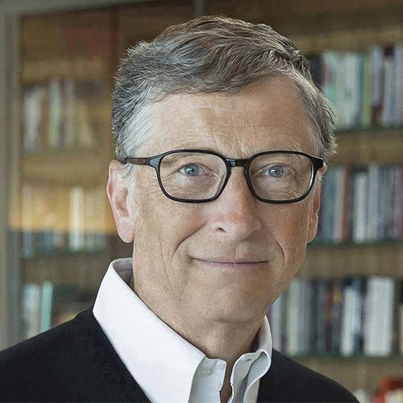

# Bill Gates

Bill Gates es cofundador de Microsoft Corporation, donde lideró la compañía como CEO y presidente de la junta hasta principios de los 2000s. Es reconocido por haber revolucionado la industria del software personal. Actualmente, se dedica a la filantropía global a través de la Fundación Bill y Melinda Gates, enfocándose en salud, educación y desarrollo sostenible.

[Ver integrantes](../integrantes.md)

[Regresar al índice](../../proyecto.md)